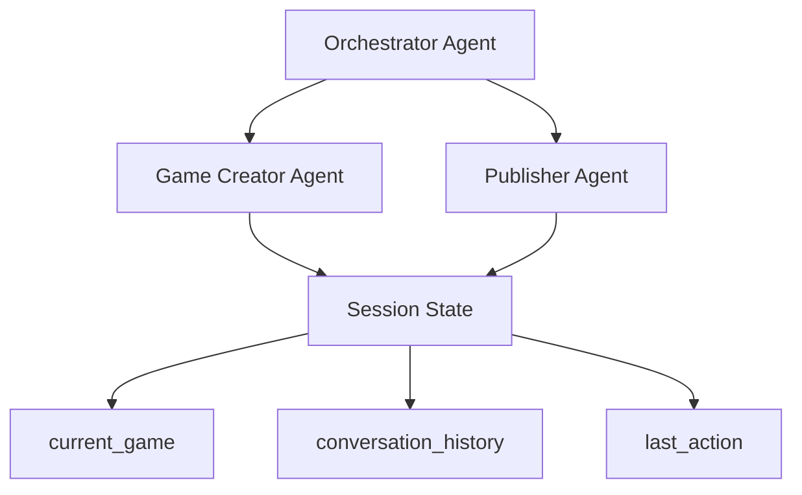

# Maya AI Agent Session Structure

This document describes how session state is managed across the Maya AI agents and the data structures used for game creation and publishing.

## Agent Architecture Overview



## Session State Structure

The Maya platform uses ADK's session state management to persist data across agent interactions:

```python
session_state = context.session.state
```

### Core Session Keys

| Key | Type | Description | Set By | Used By |
|-----|------|-------------|---------|---------|
| `current_game` | dict | Complete game data structure | Game Creator | Publisher |
| `conversation_history` | list | Chat history with metadata | Game Creator | Game Creator |
| `last_action` | string | Last action performed | Game Creator | All agents |

## Game Data Structure

When the Game Creator Agent generates a game, it stores the following structure:

```python
game_data = {
    "html": "<complete HTML5 game code>",  # Full game with embedded CSS/JS
    "css": "",                             # Empty - CSS embedded in HTML
    "js": ""                               # Empty - JS embedded in HTML
}

# Stored in session as:
session_state['current_game'] = game_data
session_state['last_action'] = 'game_creation'
```

### Key Characteristics:
- **Complete HTML**: All CSS and JavaScript are embedded within the HTML content
- **Self-contained**: The HTML can be directly deployed as a standalone game
- **No external dependencies**: Everything needed to run the game is in the HTML string

## State Flow Between Agents

### 1. Game Creation Flow

```
User Request → Orchestrator Agent → Game Creator Agent
                                         ↓
                                   Extract HTML from LLM
                                         ↓
                                   Create game_data structure
                                         ↓
                                   Store in session_state['current_game']
```

**Code Location**: `agents/maya-agent/maya_agent/sub_agents/generator/agent.py:144-156`

```python
# Game Creator stores game data
game_data = {
    "html": html_code,
    "css": "",  # CSS embedded in HTML
    "js": ""    # JS embedded in HTML
}

session_state['current_game'] = game_data
session_state['last_action'] = 'game_creation'
```

### 2. Publishing Flow

```
User Request → Orchestrator Agent → Publisher Agent
                                        ↓
                                   Access tool_context.state
                                        ↓
                                   Retrieve current_game data
                                        ↓
                                   Deploy to Firebase Hosting
```

**Code Location**: `agents/maya-agent/maya_agent/sub_agents/publisher/tools_adk.py:64`

```python
# Publisher accesses game data
current_game = tool_context.state.get('current_game')
complete_html = current_game.get('html', '')
```

## Conversation History Structure

The Game Creator Agent maintains conversation context for follow-up requests:

```python
conversation_history = [
    {
        "role": "user",
        "content": "create a snake game",
        "timestamp": "2024-01-01T12:00:00Z"
    },
    {
        "role": "assistant",
        "content": "Generated game successfully",
        "game_code": "<html>...</html>",
        "timestamp": "2024-01-01T12:00:30Z"
    }
]

session_state['conversation_history'] = conversation_history
```

## Agent Responsibilities

### Orchestrator Agent (`agent.py`)
- **State Management**: Uses ADK's built-in session context
- **Routing**: Delegates to sub-agents based on user intent
- **No Direct State**: Does not manipulate session state directly

### Game Creator Agent (`sub_agents/generator/agent.py`)
- **State Writing**: Creates and updates `current_game` structure
- **Context Tracking**: Maintains `conversation_history` for follow-ups
- **HTML Generation**: Produces complete, self-contained HTML games

### Publisher Agent (`sub_agents/publisher/agent.py`)
- **State Reading**: Accesses `current_game` from session state
- **Firebase Deployment**: Uses HTML content for hosting
- **No State Modification**: Read-only access to game data

## Session State Access Patterns

### Game Creator Agent
```python
# Read session state
session_state = context.session.state
current_game = session_state.get('current_game', None)
conversation_history = session_state.get('conversation_history', [])

# Write session state
session_state['current_game'] = game_data
session_state['conversation_history'] = updated_history
```

### Publisher Agent
```python
# Read session state through ToolContext
current_game = tool_context.state.get('current_game')

# Validate game data
if not current_game or 'html' not in current_game:
    return {"success": False, "message": "No game found"}
```

## Streaming and Real-time Updates

The Game Creator Agent uses a `StreamingContentProcessor` that also updates session state:

**Code Location**: `agents/maya-agent/maya_agent/sub_agents/generator/streaming.py:89-93`

```python
# Streaming processor also updates session state
self.session_state['current_game'] = game_data
self.session_state['last_action'] = 'game_creation'
```

## Potential Issues and Debugging

### Session State Persistence
The most critical requirement is that session state persists between orchestrator sub-agent calls:

1. **Game Creator** runs → stores `current_game` → completes
2. **Publisher** runs → must access same `current_game` data

### Debugging Session State
To debug session state issues, check:

```python
# In Publisher Agent tool
print(f"Session state keys: {list(tool_context.state.keys())}")
print(f"Current game exists: {'current_game' in tool_context.state}")
if 'current_game' in tool_context.state:
    game = tool_context.state['current_game']
    print(f"Game HTML length: {len(game.get('html', ''))}")
```

### Common Issues
1. **Session not persisting** between sub-agent calls
2. **ToolContext not receiving** session state from ADK framework  
3. **Timing issues** where publisher runs before game creator saves state
4. **State key mismatches** between what's stored and what's accessed

## File Locations

- **Orchestrator**: `agents/maya-agent/maya_agent/agent.py`
- **Game Creator**: `agents/maya-agent/maya_agent/sub_agents/generator/agent.py`
- **Streaming Processor**: `agents/maya-agent/maya_agent/sub_agents/generator/streaming.py`
- **Publisher**: `agents/maya-agent/maya_agent/sub_agents/publisher/agent.py`
- **Publisher Tools**: `agents/maya-agent/maya_agent/sub_agents/publisher/tools_adk.py`

## Expected Session State Example

After a successful game creation, the session state should contain:

```json
{
  "current_game": {
    "html": "<!DOCTYPE html><html><head><title>Snake Game</title><style>...</style></head><body>...</body></html>",
    "css": "",
    "js": ""
  },
  "conversation_history": [
    {
      "role": "user", 
      "content": "create a snake game",
      "timestamp": "2024-01-01T12:00:00Z"
    },
    {
      "role": "assistant",
      "content": "Generated game successfully", 
      "game_code": "<!DOCTYPE html>...",
      "timestamp": "2024-01-01T12:00:30Z"
    }
  ],
  "last_action": "game_creation"
}
```