# Maya AI Agent Architecture

## Architecture Overview

```mermaid
graph TD
    %% User Interface Layer
    U[👤 User] --> FE[🖥️ React Frontend<br/>ChatInterface]
    FE --> API[⚡ FastAPI Backend<br/>SSE Streaming]
    
    %% API Layer
    API --> MS[🔧 Maya Service<br/>maya_integration.py]
    MS --> ADK[🏗️ Google ADK Runner<br/>Session Management]
    
    %% Agent Architecture
    ADK --> OA[🎮 Orchestrator Agent<br/>maya_agent/agent.py]
    
    %% Sub-Agent Layer
    OA --> GCA[🎯 Game Creator Agent<br/>sub_agents/generator/agent.py]
    
    %% Processing Components
    GCA --> SP[📝 Streaming Processor<br/>sub_agents/generator/streaming.py]
    GCA --> LLM[🤖 Gemini 2.5 Pro<br/>Game Generation]
    
    %% State Management
    ADK --> SS[💾 Session State<br/>InMemorySessionService]
    SS --> CH[📚 Conversation History]
    SS --> CG[🎮 Current Game Data]
    
    %% Event Flow
    SP --> SE[📡 Structured Events]
    SE --> API
    
    %% Frontend State Management
    FE --> GC[⚙️ Game Context<br/>State Management]
    GC --> MS_UI[💬 Messages State]
    GC --> GS[🎯 Game State]
    GC --> ST[📊 Status State]
    
    %% UI Components
    GC --> CI[💭 Chat Interface]
    GC --> SB[📈 Status Box]
    GC --> CSB[💻 Code Stream Box]
    GC --> SC[💡 Suggestion Cards]
    GC --> GP[🎮 Game Preview]
    
    %% Event Types
    subgraph "📡 SSE Event Types"
        E1[status: thinking/generating]
        E2[explanation: Game description]
        E3[code_chunk: Live streaming]
        E4[features: Game features list]
        E5[suggestions: Modification ideas]
        E6[code: Final game object]
        E7[error: Error handling]
    end
    
    SE --> E1
    SE --> E2
    SE --> E3
    SE --> E4
    SE --> E5
    SE --> E6
    SE --> E7
    
    %% Status Progression
    subgraph "📊 Status Progression"
        P1[🔍 Analyzing] --> P2[🧠 Planning]
        P2 --> P3[📝 Outlining]
        P3 --> P4[⚡ Generating]
        P4 --> P5[✅ Completed]
    end
    
    SB --> P1
    
    %% Data Flow Annotations
    U -.->|"1. User types game request"| FE
    FE -.->|"2. POST /generate-game-real"| API
    API -.->|"3. Stream SSE events"| MS
    MS -.->|"4. ADK agent execution"| ADK
    OA -.->|"5. Delegate to specialist"| GCA
    GCA -.->|"6. LLM generation"| LLM
    LLM -.->|"7. Structured response"| SP
    SP -.->|"8. Parsed events"| SE
    SE -.->|"9. Real-time updates"| FE
    FE -.->|"10. UI updates"| U
    
    %% Styling
    classDef user fill:#e1f5fe,stroke:#01579b,stroke-width:2px
    classDef frontend fill:#f3e5f5,stroke:#4a148c,stroke-width:2px
    classDef backend fill:#e8f5e8,stroke:#1b5e20,stroke-width:2px
    classDef agent fill:#fff3e0,stroke:#e65100,stroke-width:2px
    classDef llm fill:#fce4ec,stroke:#880e4f,stroke-width:2px
    classDef state fill:#f1f8e9,stroke:#33691e,stroke-width:2px
    classDef events fill:#e0f2f1,stroke:#004d40,stroke-width:2px
    
    class U user
    class FE,GC,CI,SB,CSB,SC,GP,MS_UI,GS,ST frontend
    class API,MS backend
    class ADK,OA,GCA,SP agent
    class LLM llm
    class SS,CH,CG,E1,E2,E3,E4,E5,E6,E7 state
    class SE,P1,P2,P3,P4,P5 events
```



## System Flow Description

### 1. **User Interface Layer**
- **User**: Interacts with the web interface
- **React Frontend**: Handles UI rendering and real-time updates
- **ChatInterface**: Main conversation interface with status displays

### 2. **API Layer**
- **FastAPI Backend**: Handles HTTP requests and SSE streaming
- **Maya Service**: Orchestrates agent communication and session management
- **ADK Runner**: Google Agent Development Kit execution environment

### 3. **Agent Architecture**
- **Orchestrator Agent**: Main agent that delegates to specialists
- **Game Creator Agent**: Specialized agent for game generation
- **Streaming Processor**: Parses LLM responses into structured events

### 4. **LLM Integration**
- **Gemini 2.5 Pro**: Generates game code and responses
- **Structured Prompting**: Context-aware prompts for new vs follow-up requests

### 5. **State Management**
- **Session State**: Persistent conversation and game data
- **Frontend State**: Real-time UI state management
- **Message History**: Complete conversation persistence

### 6. **Event System**
The system uses Server-Sent Events (SSE) for real-time communication:

- **status**: thinking/generating phases
- **explanation**: Game description text
- **code_chunk**: Live code streaming
- **features**: Game features list
- **suggestions**: Modification ideas
- **code**: Final game object
- **error**: Error handling

### 7. **Status Progression**
Real-time status updates flow through:
🔍 Analyzing → 🧠 Planning → 📝 Outlining → ⚡ Generating → ✅ Completed

### 8. **UI Components**
- **Status Box**: Shows current generation phase
- **Code Stream Box**: Live code display with syntax highlighting
- **Suggestion Cards**: Dynamic modification suggestions
- **Game Preview**: Iframe-based game testing

## Key Features

✅ **Real-time Streaming**: Live updates during generation
✅ **Persistent State**: Conversations and games persist across sessions
✅ **Contextual Responses**: Follow-up requests understand previous context
✅ **Progressive Status**: Clear indication of generation progress
✅ **Modular Architecture**: Orchestrator delegates to specialized agents
✅ **Error Handling**: Comprehensive error management and user feedback
✅ **Session Management**: ADK-powered conversation persistence

## File Structure

```
maya/
├── frontend/                    # React TypeScript frontend
│   ├── src/contexts/GameContext.tsx     # State management
│   ├── src/components/chat/ChatInterface.tsx  # Main chat UI
│   ├── src/components/ui/StatusBox.tsx         # Status display
│   └── src/components/ui/CodeStreamBox.tsx     # Code display
├── api/                        # FastAPI backend
│   ├── main.py                 # API endpoints
│   └── maya_integration.py     # Agent integration
└── agents/maya-agent/          # ADK agent architecture
    ├── maya_agent/agent.py     # Orchestrator agent
    └── maya_agent/sub_agents/generator/
        ├── agent.py            # Game creator specialist
        ├── prompts.py          # LLM prompts
        └── streaming.py        # Response processor
```