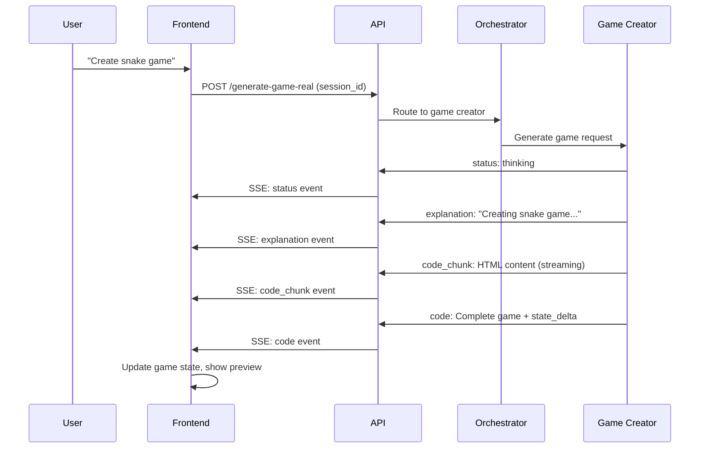
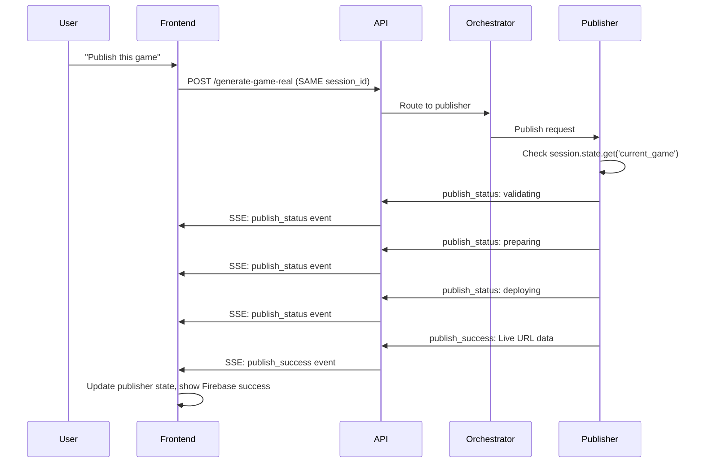

# Maya AI Game Creation Platform - Complete Technical History

## Project Overview

Maya is an AI-powered game creation platform that allows users to describe games in natural language and receive fully functional HTML5 games with real-time streaming generation and Firebase deployment capabilities. The platform has evolved through multiple phases from basic game generation to a sophisticated multi-agent system with publishing capabilities.

## Current Architecture (v3.1)

```
┌─────────────────────────────────────────────────────────────────┐
│                    Maya AI Platform                             │
├─────────────────────────────────────────────────────────────────┤
│  Frontend (React/TypeScript + Vite + Tailwind)                 │
│  ├── ChatInterface: Conversational UI with SSE streaming       │
│  ├── GamePanel: Preview/Assets/Code tabs with iframe rendering │
│  ├── GameContext: State management for game + publisher ops    │
│  └── StatusBox/BuildingStatus: Real-time progress indicators   │
├─────────────────────────────────────────────────────────────────┤
│  Backend API (FastAPI)                                         │
│  ├── /generate-game-real: SSE streaming endpoint               │
│  ├── Maya agent integration with conversation persistence      │
│  └── CORS configuration for cross-origin requests             │
├─────────────────────────────────────────────────────────────────┤
│  Agent Architecture (Google ADK)                               │
│  ├── Orchestrator Agent: Routes to specialized agents          │
│  ├── Game Creator Agent: Generates HTML5 games with streaming  │
│  └── Publisher Agent: Firebase CLI deployment with events      │
├─────────────────────────────────────────────────────────────────┤
│  Session Management (CRITICAL DISCOVERY)                       │
│  ├── ADK InMemorySessionService: Agent state persistence       │
│  ├── EventActions.state_delta: ONLY proper way to persist state│
│  └── Session ID consistency across conversation flows          │
└─────────────────────────────────────────────────────────────────┘
```

## Technology Stack

### Frontend
- **Framework**: React 18 with TypeScript
- **Build Tool**: Vite for fast development and hot reloading
- **Styling**: Tailwind CSS with custom cyberpunk theme
- **UI Components**: Shadcn/ui component library
- **State Management**: React Context API with GameContext
- **Real-time Communication**: Server-Sent Events (SSE) for streaming
- **Code Rendering**: iframe with srcDoc for secure game preview
- **Icons**: Lucide React for consistent iconography

### Backend
- **API Framework**: FastAPI with async/await support
- **Agent Framework**: Google Agent Development Kit (ADK)
- **Session Management**: InMemorySessionService for conversation state
- **Streaming**: SSE with structured event types
- **Deployment**: Firebase CLI integration for game hosting

### Agent Architecture
- **Model**: Gemini 2.5 Pro for complex reasoning tasks
- **Agent Pattern**: Multi-agent orchestration with specialized sub-agents
- **State Management**: EventActions.state_delta for proper ADK patterns
- **Tool Integration**: Firebase CLI tools for deployment automation

## Development Phases

### Phase 1: Basic Platform (Initial Implementation)
- Single Game Creator Agent with basic HTML5 generation
- Simple chat interface with static responses
- Basic React frontend with preview panel
- Mock streaming responses for UX testing

### Phase 2: Real-time Streaming (Enhanced UX)
- ADK agent integration with real LLM responses
- SSE streaming implementation for real-time updates
- Enhanced state management and conversation persistence
- Progressive status indicators and code streaming
- FormattedText utility for better message display

### Phase 3: Multi-Agent Architecture (Publisher Integration)
- **Game Creator Agent**: Specialized for game mechanics and code generation
- **Publisher Agent**: Firebase deployment with structured event flow
- **Orchestrator Agent**: Intelligent routing between specialized agents
- **Unified Frontend**: Operation-aware UI supporting both creation and publishing

## Critical Architecture Discoveries

### 1. ADK Session State Management (MOST IMPORTANT)

**CRITICAL DISCOVERY**: Direct state manipulation bypasses ADK's event tracking system and breaks state persistence.

```python
# ❌ WRONG - This bypasses ADK event system and breaks persistence
context.session.state['current_game'] = game_data

# ✅ CORRECT - This is the ONLY way to properly persist state in ADK
return Event(
    author="agent",
    content=types.Content(
        role="model", 
        parts=[types.Part(text=json.dumps(event_data))]
    ),
    actions=EventActions(state_delta={'current_game': game_data})
)
```

**Why This Matters**:
- ADK tracks state changes through EventActions.state_delta
- Direct manipulation breaks session continuity between agent calls
- Publisher agent couldn't access game data without proper state management
- This was the root cause of "publisher agent not working"

### 2. Session ID Consistency

**Discovery**: Same session ID MUST be used across entire conversation flow for state persistence.

```typescript
// Frontend - persistent session ID
const [sessionId] = useState(() => 
  `session_${Date.now()}_${Math.random().toString(36).substr(2, 9)}`
);

// Must use same sessionId for both game creation AND publishing
await mayaAPI.generateGame({ prompt, session_id: sessionId, user_id: 'maya_user' });
```

### 3. Operation Type Detection Pattern

**Discovery**: Frontend needs to distinguish between different operation types for proper UI rendering.

```typescript
// Event-based operation detection
if (['publish_status', 'publish_success', 'publish_error'].includes(event.type)) {
  setGameState(prev => ({ ...prev, operationType: 'publishing' }));
} else if (['status', 'explanation', 'code', 'features'].includes(event.type)) {
  setGameState(prev => ({ ...prev, operationType: 'game_creation' }));
}
```

### 4. iframe Game Rendering Pattern

**Discovery**: Complete HTML document assembly required for proper game rendering.

```typescript
const completeHTML = (() => {
  const html = gameState.code.html;
  const css = gameState.code.css || '';
  const js = gameState.code.js || '';
  
  // If HTML already complete, use as-is
  if (html.includes('<style>') && html.includes('<script>')) {
    return html;
  }
  
  // Otherwise, inject CSS and JS into proper locations
  let result = html;
  if (css && !html.includes('<style>')) {
    result = result.replace('</head>', `<style>${css}</style></head>`);
  }
  if (js && !html.includes('<script>')) {
    result = result.replace('</body>', `<script>${js}</script></body>`);
  }
  return result;
})()
```

## Agent Implementation Details

### 1. Game Creator Agent (`/agents/maya-agent/maya_agent/sub_agents/generator/agent.py`)

**Purpose**: Generates complete HTML5 games from natural language descriptions

**Key Implementation Pattern**:
```python
def _create_sse_event_with_state(self, event_type: str, payload, state_delta: dict) -> Event:
    """CRITICAL: This is how to properly persist state in ADK"""
    return Event(
        author="agent",
        content=types.Content(
            role="model",
            parts=[types.Part(text=json.dumps({'type': event_type, 'payload': payload}))]
        ),
        actions=EventActions(state_delta=state_delta)  # This persists state properly
    )
```

**Event Flow**:
1. `status: thinking` → User feedback about analysis
2. `explanation` → Game concept description
3. `code_chunk` → Real-time code streaming
4. `features` → Game feature list
5. `suggestions` → Follow-up modification suggestions
6. `code` → Final complete game with state persistence

### 2. Publisher Agent (`/agents/maya-agent/maya_agent/sub_agents/publisher/agent.py`)

**Purpose**: Deploys generated games to Firebase hosting with real-time status updates

**Key Architecture**: Custom `_run_async_impl` method that emits structured publisher events:

```python
async def _run_async_impl(self, context, **kwargs) -> AsyncGenerator[Event, None]:
    # Phase 1: Validation - Check if game exists in session state
    yield self._create_publisher_event("publish_status", "validating")
    current_game = context.session.state.get('current_game')
    
    if not current_game or not current_game.get('html'):
        yield self._create_publisher_event("publish_error", "no_game")
        return
    
    # Phase 2: Preparation
    yield self._create_publisher_event("publish_status", "preparing")
    
    # Phase 3: Deployment
    yield self._create_publisher_event("publish_status", "deploying")
    
    # Phase 4: Success/Error handling
    result = publish_game(user_prompt, tool_context)
    if result["success"]:
        yield self._create_publisher_event("publish_success", {
            "live_url": result["live_url"],
            "site_name": result["site_name"],
            "message": result["message"]
        })
```

**Publisher Event Types**:
- `publish_status`: validating → preparing → deploying
- `publish_success`: Live URL and Firebase branding
- `publish_error`: Specific error handling (no_game, deployment_failed, unexpected_error)
- `publish_message`: Chat integration for user communication

### 3. Orchestrator Agent (`/agents/maya-agent/maya_agent/agent.py`)

**Purpose**: Intelligent routing between specialized agents based on user intent

**Routing Logic**:
```python
# LLM-based intent classification (not keyword matching)
if "publish" in prompt.lower() or "deploy" in prompt.lower() or "online" in prompt.lower():
    # Route to publisher agent
    async for event in self.publisher_agent._run_async_impl(context):
        yield event
else:
    # Route to game creator agent
    async for event in self.game_creator_agent._run_async_impl(context):
        yield event
```

## Frontend Architecture Deep Dive

### 1. GameContext State Management (`/frontend/src/contexts/GameContext.tsx`)

**Unified State Interface**:
```typescript
interface GameState {
  code: GameCode | null;                    // Generated game code
  isGenerating: boolean;                    // Game creation in progress
  status: 'idle' | 'thinking' | 'generating' | 'completed' | 'error';
  statusBox: StatusBoxState;               // Real-time status indicators
  codeStream: CodeStreamState;             // Live code streaming display
  suggestions: string[];                   // LLM-generated follow-up suggestions
  publisher: PublisherState;               // Firebase publishing state
  operationType: 'game_creation' | 'publishing' | 'idle';  // Current operation
}

interface PublisherState {
  status: 'idle' | 'validating' | 'preparing' | 'deploying' | 'published' | 'error';
  liveUrl?: string;
  siteName?: string;
  error?: string;
  isPublishing: boolean;
}
```

**Critical Pattern**: State preservation during operations:
```typescript
// Keep previous state during new operations
codeStream: {
  content: prev.codeStream.content, // Keep previous content until new arrives
  currentType: prev.codeStream.currentType,
  isStreaming: false
},
suggestions: prev.suggestions, // Keep previous suggestions until new ones arrive
```

### 2. Chat Interface UX Patterns (`/frontend/src/components/chat/ChatInterface.tsx`)

**Operation-Aware Status Bullets**:
```typescript
const getOverallStatusBullets = useCallback((): string[] => {
  const { operationType, publisher, status, phase } = gameState;
  
  // Publisher operations get Firebase-specific messaging
  if (operationType === 'publishing') {
    if (publisher.status === 'published') {
      return [
        '✅ Game verified',
        '✅ Deployment prepared', 
        '✅ Files uploaded to Firebase',
        '✅ Hosting configured',
        '🎉 Game is now live on Firebase!'
      ];
    }
    // ... other publisher states
  }
  
  // Game creation operations get development-focused messaging
  if (status === 'completed') {
    return [
      '✅ Request analyzed',
      '✅ Game concept designed',
      '✅ Code generated', 
      '✅ Features implemented',
      '🎮 Game completed!'
    ];
  }
  // ... other creation states
}, [gameState]);
```

**Live Status vs Final Message Pattern**:
```typescript
// Live status only shows during active operations, not when completed
{(gameState.isGenerating || gameState.publisher.isPublishing) && 
 !(gameState.status === 'completed' || gameState.publisher.status === 'published') && (
  <BuildingStatus bullets={getOverallStatusBullets()} isCompleted={false} />
)}

// Final message captures completion state
useEffect(() => {
  if ((gameState.status === 'completed' && !gameState.isGenerating) || 
      (gameState.publisher.status === 'published' && !gameState.publisher.isPublishing)) {
    // Create final message with completion status
  }
}, [gameState.status, gameState.publisher.status]);
```

### 3. Game Panel Rendering (`/frontend/src/components/panels/GamePanel.tsx`)

**Operation-Aware Tab Rendering**:
```typescript
// Preview tab only shows loading during game creation, not publishing
{gameState.isGenerating && gameState.operationType === 'game_creation' ? (
  <LoadingState message="Planning Your Game" />
) : gameState.code?.html ? (
  <iframe srcDoc={completeHTML} />
) : (
  <EmptyState />
)}

// Code tab shows streaming only during game creation
{gameState.codeStream.isStreaming && gameState.operationType === 'game_creation' ? (
  <StreamingCodeDisplay />
) : gameState.code?.html ? (
  <StaticCodeDisplay />
) : (
  <EmptyCodeState />
)}
```

## Common Issues & Solutions

### 1. Session State Not Persisting
**Symptom**: Publisher agent can't access game data created by game creator
**Root Cause**: Direct state manipulation bypasses ADK event system
**Solution**: Use EventActions.state_delta pattern
**Detection**: "No game found" errors during publishing

### 2. Duplicate Status Messages
**Symptom**: Completion status appears twice during publishing
**Root Cause**: Live status and final message both showing completion bullets
**Solution**: Exclude completed states from live status display
**Code Fix**: `!(gameState.status === 'completed' || gameState.publisher.status === 'published')`

### 3. Code Streaming During Publishing
**Symptom**: Code stream box appears during publishing operations
**Root Cause**: Missing operation type filtering
**Solution**: Add `operationType === 'game_creation'` condition
**UX Impact**: Confusing to show code generation UI during deployment

### 4. Session ID Inconsistency
**Symptom**: "This is so basic!" - different session IDs breaking conversation flow
**Root Cause**: Generating new session ID for each request instead of persisting
**Solution**: Use same session ID throughout conversation
**Critical**: Frontend must maintain persistent session ID

### 5. iframe Rendering Issues
**Symptom**: Games not displaying correctly in preview
**Root Cause**: Incomplete HTML document structure
**Solution**: Proper CSS/JS injection into HTML before iframe rendering
**Security**: Use srcDoc with sandbox attributes for isolation

### 6. CORS Configuration
**Symptom**: Frontend can't connect to FastAPI backend
**Root Cause**: Missing CORS middleware configuration
**Solution**: Proper FastAPI CORS setup with allow_origins=["http://localhost:5173"]

## Event Flow Diagrams

### Game Creation Flow


### Publishing Flow  


## Design Decisions & Rationale

### 1. Multi-Agent Architecture vs Monolithic
**Decision**: Separate specialized agents (Game Creator + Publisher)
**Rationale**: 
- Clear separation of concerns (game mechanics vs deployment)
- Easier testing and debugging
- Scalable for additional features (asset generation, etc.)
- Independent development and maintenance

### 2. SSE vs WebSocket for Streaming
**Decision**: Server-Sent Events for real-time communication
**Rationale**:
- Simpler implementation than WebSocket
- Unidirectional flow fits streaming use case
- Better browser support and debugging
- Automatic reconnection handling
- No need for bidirectional communication

### 3. iframe vs Direct DOM for Game Preview
**Decision**: iframe with srcDoc for game rendering
**Rationale**:
- Security isolation for user-generated code
- Prevents CSS/JS conflicts with main app
- Sandboxing capabilities prevent malicious code
- Clean reset for new games
- Better error containment

### 4. React Context vs External State Management
**Decision**: React Context API instead of Redux/Zustand
**Rationale**:
- Simpler setup for current scope
- Built-in React pattern, no external dependencies
- Sufficient for single-context state management
- Better TypeScript integration
- Easier debugging with React DevTools

### 5. Firebase CLI vs Firebase SDK
**Decision**: Firebase CLI integration instead of direct SDK usage
**Rationale**:
- Leverages existing developer tooling
- Simpler deployment pipeline
- Better error handling and logging
- Matches standard developer workflow
- Easier to debug deployment issues

### 6. EventActions.state_delta vs Direct State Manipulation
**Decision**: Always use EventActions.state_delta for ADK state management
**Rationale**:
- Only way to properly persist state in ADK
- Enables proper session continuity
- Required for multi-agent workflows
- Provides event tracking and debugging
- Critical for conversation-based applications

## Performance Considerations

### 1. Code Streaming Optimization
- **Chunked Delivery**: Prevents blocking on large games
- **Progressive Rendering**: Keeps UI responsive during generation
- **Buffer Management**: SSE client prevents memory leaks
- **Event Throttling**: Prevents UI flooding with rapid events

### 2. State Management Efficiency
- **Operation Type Detection**: Prevents unnecessary re-renders
- **Selective Updates**: Using functional setState patterns
- **Memoized Callbacks**: useCallback for status bullet generation
- **State Preservation**: Keeping previous data during operations

### 3. iframe Rendering Performance
- **srcDoc Usage**: Prevents additional network requests
- **Sandbox Attributes**: Security without performance cost
- **Lazy Loading**: Prevents impact on inactive tabs
- **Content Assembly**: Efficient HTML/CSS/JS combination

## Security Considerations

### 1. User-Generated Code Execution
- **iframe Sandboxing**: Prevents malicious script execution
- **srcDoc Isolation**: No access to parent window
- **Content Security Policy**: Additional security headers
- **Safe HTML Assembly**: Controlled CSS/JS injection

### 2. Session Management
- **Cryptographic Session IDs**: Secure random generation
- **No Sensitive Data**: Session state contains only game data
- **Automatic Cleanup**: InMemorySessionService handles cleanup
- **Cross-Request Isolation**: No session data leakage

### 3. Firebase Integration Security
- **CLI-Based Deployment**: Uses secure Firebase authentication
- **No API Keys in Frontend**: All credentials server-side
- **Hosted Game Security**: Inherits Firebase security features
- **Limited Permissions**: Deployment-only access scope

## Development Workflow & Best Practices

### 1. Adding New Agents
1. Create agent directory under `/agents/maya-agent/maya_agent/sub_agents/`
2. Implement agent class extending LlmAgent
3. Define tool functions with proper Pydantic schemas
4. Use EventActions.state_delta for all state persistence
5. Add event handling in frontend GameContext
6. Update UI components with operation-aware rendering
7. Test with consistent session IDs across flows

### 2. Debugging Session Issues  
1. Check EventActions.state_delta usage in agent implementations
2. Verify session ID consistency in frontend API calls
3. Inspect ADK session state in agent context
4. Validate frontend state management patterns
5. Use browser DevTools to monitor SSE events
6. Check FastAPI logs for agent routing decisions

### 3. Testing Strategies
- **Unit Tests**: Individual agent tools with mock contexts
- **Integration Tests**: Multi-agent flows with real session state
- **Frontend Tests**: Mock SSE events for UI component testing
- **End-to-End Tests**: Full conversation flows with real Firebase deployment
- **Session Tests**: State persistence across agent calls

## File Structure

```
maya/
├── frontend/                              # React TypeScript frontend
│   ├── src/
│   │   ├── contexts/GameContext.tsx       # Unified state management
│   │   ├── components/
│   │   │   ├── chat/ChatInterface.tsx     # Main conversational UI
│   │   │   ├── panels/GamePanel.tsx       # Preview/Assets/Code tabs
│   │   │   └── ui/                        # Reusable UI components
│   │   │       ├── StatusBox.tsx          # Dynamic status display
│   │   │       ├── BuildingStatus.tsx     # Progress indicators
│   │   │       ├── CodeStreamBox.tsx      # Real-time code display
│   │   │       └── SuggestionCards.tsx    # LLM suggestions
│   │   ├── services/api.ts                # SSE client and API types
│   │   └── utils/textFormatter.tsx        # Markdown-style text processing
│   └── public/                            # Static assets
├── api/                                   # FastAPI backend
│   ├── main.py                           # API endpoints and CORS
│   └── maya_integration.py               # ADK agent integration
├── agents/maya-agent/                     # ADK agent architecture
│   └── maya_agent/
│       ├── agent.py                      # Orchestrator agent
│       ├── config.py                     # Model configuration
│       ├── prompts.py                    # System prompts
│       └── sub_agents/
│           ├── generator/                # Game Creator Agent
│           │   ├── agent.py             # Core game generation logic
│           │   ├── prompts.py           # Game generation prompts
│           │   └── streaming.py         # Response processing
│           └── publisher/               # Publisher Agent
│               ├── agent.py             # Firebase deployment logic
│               ├── prompts.py           # Publishing prompts
│               ├── schemas.py           # Firebase configuration
│               └── tools_adk.py         # Firebase CLI tools
├── pyproject.toml                        # Python dependencies (uv)
├── uv.lock                              # Dependency lock file
└── history.md                           # This comprehensive documentation
```

## Known Limitations

### 1. Session Persistence
- **InMemorySessionService**: Doesn't survive server restarts
- **Single-User**: No multi-user concurrent session support
- **Cross-Device**: No conversation continuity across devices
- **Scalability**: Limited by server memory for large user bases

### 2. Game Complexity Constraints
- **HTML5 Only**: Limited to browser-based games
- **No External Assets**: Cannot include images, audio files, or external resources
- **Single File**: Complete game must fit in one HTML document
- **No Server Logic**: Static hosting only, no backend game logic

### 3. Deployment Limitations  
- **Firebase Only**: No support for other hosting platforms
- **Static Hosting**: No server-side game logic or databases
- **Manual Domains**: Custom domain configuration requires manual setup
- **Storage Limits**: Subject to Firebase hosting quotas

### 4. Agent Architecture Constraints
- **No Parallel Execution**: Agents run sequentially, not in parallel
- **Memory-Based State**: Session state doesn't persist across server restarts
- **Single Model**: All agents use same LLM model
- **Error Recovery**: Limited fallback strategies for failed agent operations

## Future Architecture Considerations

### 1. Scalability Improvements
- **Persistent Session Storage**: Redis or database-backed session service
- **Multi-User Support**: User authentication and session isolation
- **Agent Parallelization**: Concurrent agent execution for complex workflows
- **Load Balancing**: Multiple backend instances for high availability

### 2. Feature Extensibility
- **Asset Generation Agent**: Image/audio generation capabilities
- **Game Template System**: Predefined game types and patterns
- **Multiplayer Support**: Real-time multiplayer game generation
- **Version Control**: Game iteration and rollback capabilities

### 3. Platform Integration
- **Multiple Deployment Targets**: Vercel, Netlify, GitHub Pages
- **Asset Storage**: CDN integration for game assets
- **Analytics Integration**: Game performance and user engagement tracking
- **Social Features**: Game sharing and community features

### 4. Development Experience
- **Agent Testing Framework**: Comprehensive testing utilities for ADK agents
- **Development Dashboard**: Real-time monitoring of agent performance
- **Configuration Management**: Environment-specific agent configurations
- **Debugging Tools**: Enhanced logging and tracing for agent workflows

## Version History

### v1.0 - Initial Implementation
- Basic game generation with mock responses
- Simple chat interface with static preview
- Single-agent architecture with basic streaming

### v2.0 - Real Agent Integration  
- ADK agent architecture implementation
- SSE streaming with real LLM responses
- Enhanced state management and conversation persistence
- Progressive status indicators and code streaming

### v3.0 - Publisher Integration
- Multi-agent architecture with specialized agents
- Firebase CLI deployment integration
- Publisher agent with structured event flow
- Operation-aware frontend UI

### v3.1 - UX Refinements (Current)
- Fixed duplicate status messages and UI confusion
- Operation-specific code streaming and status bullets
- Enhanced Firebase branding and messaging
- Improved session state management with proper ADK patterns

## Critical Success Factors

### 1. **EventActions.state_delta Pattern**
This is the foundation of the entire multi-agent system. Without proper ADK state management, the platform doesn't work.

### 2. **Session ID Consistency** 
The same session ID must be used throughout a conversation for state persistence between agents.

### 3. **Operation Type Detection**
Frontend must distinguish between different operation types to render appropriate UI states.

### 4. **Structured Event System**
Clear event type differentiation enables complex real-time interfaces and agent coordination.

### 5. **iframe Security Model**
Safe execution of user-generated game code while maintaining platform security.

## Troubleshooting Guide

### Publisher Agent Not Working
1. **Check State Persistence**: Verify EventActions.state_delta usage in Game Creator
2. **Session ID Consistency**: Ensure same session ID used for creation and publishing
3. **Agent Routing**: Confirm orchestrator routes publish requests to publisher agent
4. **Firebase CLI**: Verify Firebase CLI authentication and project configuration

### Streaming Issues
1. **Event Type Classification**: Check SSE event type handling in GameContext
2. **Operation Detection**: Verify operationType is set correctly based on events
3. **State Race Conditions**: Ensure useEffect dependencies are correct
4. **Buffer Management**: Check SSE client buffer handling for large responses

### UI State Confusion
1. **Live vs Final Status**: Ensure live status excludes completed operations
2. **Code Streaming Scope**: Verify code streaming only shows during game creation
3. **Operation Isolation**: Check that publishing doesn't trigger game creation UI

This documentation serves as the complete technical reference for the Maya AI platform, capturing all architectural decisions, discovered patterns, common issues, and implementation details for future development and debugging.